# EduSubmit

A showcase school assignment and submission management platform built with a .Net clean architecture backend and modern Angular frontend.

Architecture: DDD + CQRS + Clean Architecture (Backend) · Angular 20 Standalone (Frontend)

## Live Demo

- Frontend: https://edusubmit-web-gamma.vercel.app/login
- API Documentation: https://edusubmitapi.onrender.com/swagger/index.html

## Overview

EduSubmit is a full-stack education management system designed to streamline classroom operations. It helps schools manage:

- classes and subjects
- teacher-to-subject assignments
- student enrollment
- assignment creation and publishing
- student submissions and grading
- role-based access for Admin, Teacher, and Student users

This project is created as a portfolio-style showcase to demonstrate production-oriented API design, domain modeling, authentication, and a modern frontend experience.

## Tech Stack

### Backend

- ASP.NET Core 9 Web API
- Clean Architecture / DDD / CQRS
- MediatR
- EF Core + PostgreSQL
- JWT authentication
- FluentValidation

### Frontend

- Angular 20
- Standalone components
- Reactive forms
- Signals
- SCSS

## Project Structure

- src/EduSubmit.Api
- src/EduSubmit.Application
- src/EduSubmit.Domain
- src/EduSubmit.Infrastructure
- client/EduSubmit.Web
- docker-compose.yml
- .env
- tests/

## Design Principles

- Clean Architecture with clear separation between domain, application, infrastructure, and API layers
- DDD tactical patterns such as entities, value objects, aggregates, and domain events
- CQRS for read and write flows using MediatR commands and queries
- Result-based validation to keep business rules explicit and predictable
- JWT-based role authentication for Admin, Teacher, and Student users
- PostgreSQL as the relational database for demo and production-like data modeling

## Prerequisites

Before running the project, install:

- .NET 9 SDK
- Node.js 20+
- npm
- Docker Desktop

## Getting Started

### 1. Start PostgreSQL

```bash
docker compose up -d
```

### 2. Configure local secrets

This project uses .NET user secrets for local development.

Run the commands below inside the API folder:

```bash
cd src/EduSubmit.Api
dotnet user-secrets init

dotnet user-secrets set "ConnectionStrings:DefaultConnection" "Host=localhost;Port=5433;Database=edusubmit;Username=postgres;Password=edusubmit_dev_password"
dotnet user-secrets set "JwtSettings:SecretKey" "X7kP9mQ2vL8nR4tY6wZ1aB5cD8eF3gH9"
dotnet user-secrets set "JwtSettings:Issuer" "EduSubmit.Api"
dotnet user-secrets set "JwtSettings:Audience" "EduSubmit.Client"
dotnet user-secrets set "JwtSettings:ExpiryMinutes" "60"
```

### 3. Run the backend

```bash
dotnet restore
dotnet run
```

Available URLs:

- API: http://localhost:5091
- Swagger: http://localhost:5091/swagger

### 4. Run the frontend

Open a second terminal:

```bash
cd client/EduSubmit.Web
npm install
npm start
```

Frontend URL:

- http://localhost:4200

## Demo Credentials

The database seeder automatically creates default showcase users.

| Role    | Name            | Email                        | Password    |
| ------- | --------------- | ---------------------------- | ----------- |
| Admin   | System Admin    | admin@edusubmit.com          | Admin@123   |
| Teacher | Md. Rakib Hasan | rakib.hasan@edusubmit.com    | Teacher@123 |
| Student | Arafat Hossain  | arafat.hossain@edusubmit.com | Student@123 |

## How to Test the Application

1. Open the frontend at http://localhost:4200
2. Log in using one of the demo credentials above
3. Explore role-specific workflows:
   - Admin: manage users, classes, subjects, and relationships
   - Teacher: create assignments and grade submissions
   - Student: view assignments and submit work
4. Use Swagger at http://localhost:5091/swagger for API testing

## Build and Validation

### Backend build

```bash
dotnet build EduSubmit.sln
```

### Backend tests

```bash
dotnet test EduSubmit.sln
```

### Frontend build

```bash
cd client/EduSubmit.Web
npm run build
```

## Reset the Database

If you want to reset the seeded data:

```bash
docker compose down -v
```

Then restart the database:

```bash
docker compose up -d
```

The seed data will be recreated on the next API startup.

## Screenshots

You can store screenshots in a dedicated folder like this:

```bash
screenshots/
  login-page.png
  admin-dashboard.png
  teacher-grading.png
  student-submission.png
```

Then reference them in this README using Markdown image links.

### Login page

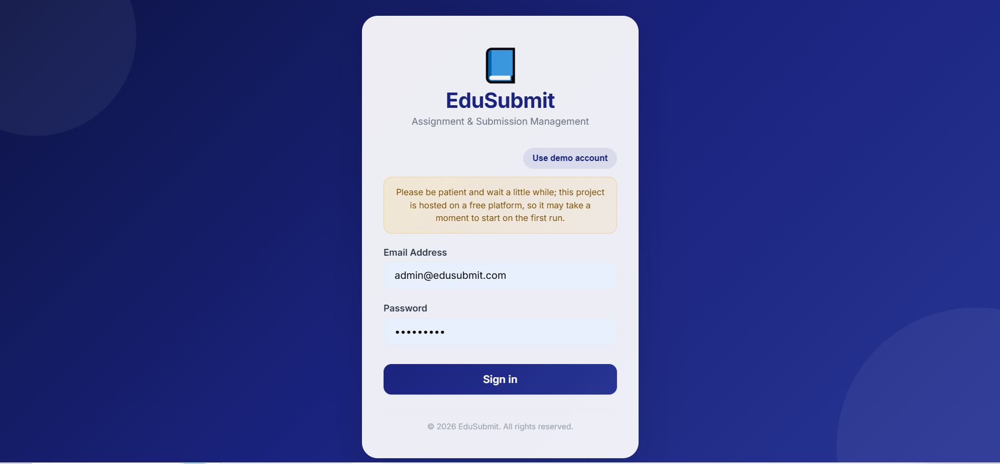

### Admin View

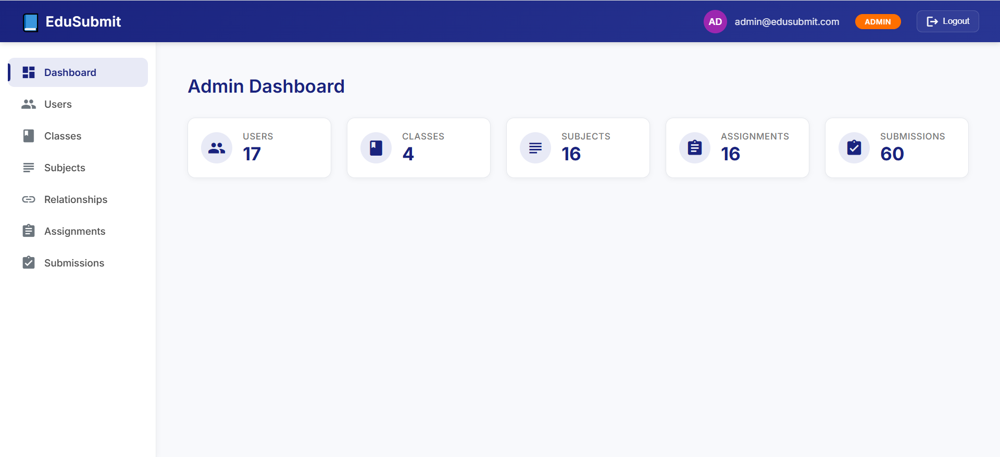
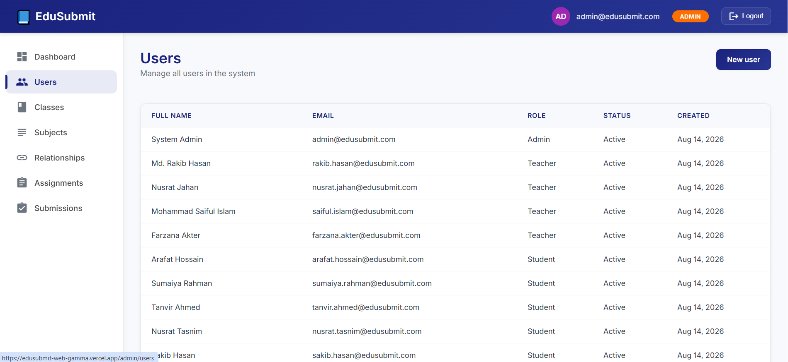
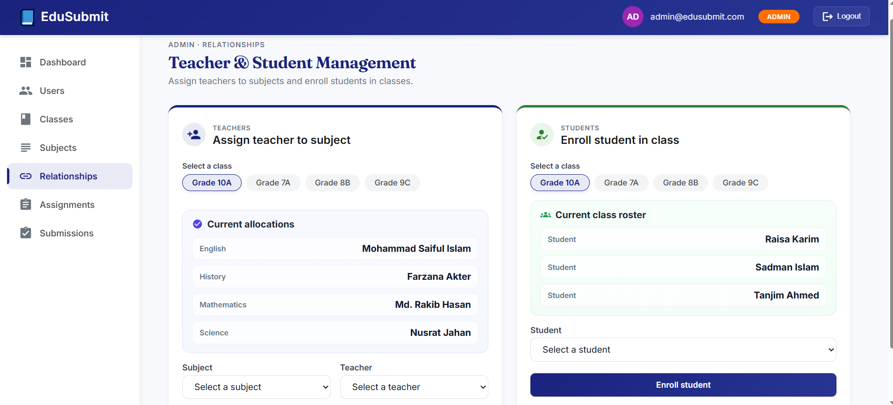
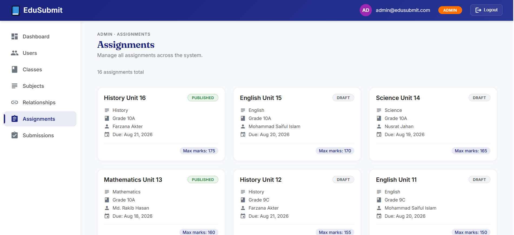
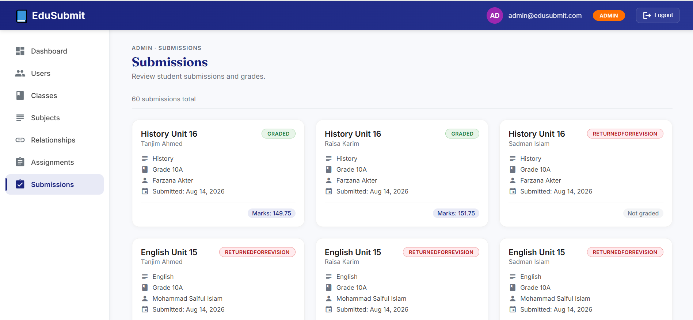

### Teacher View

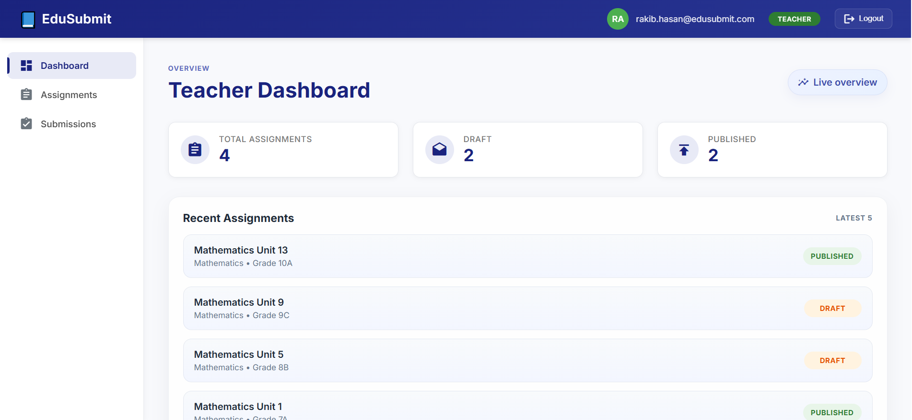
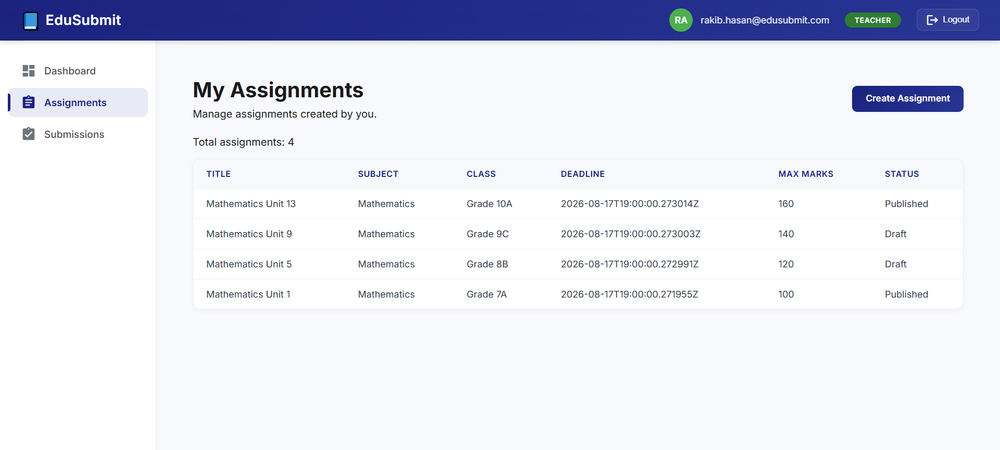
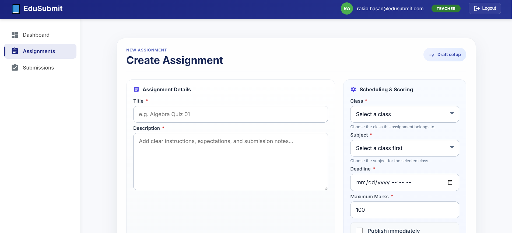
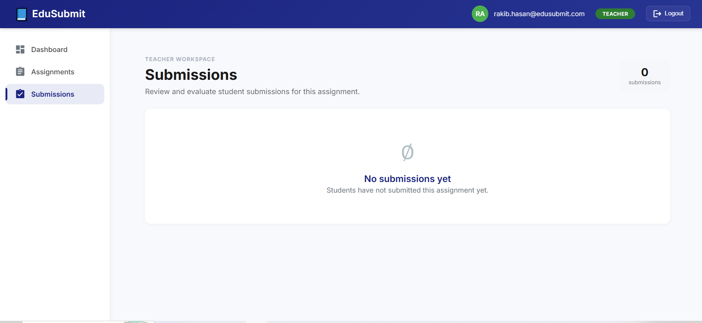

### Student View

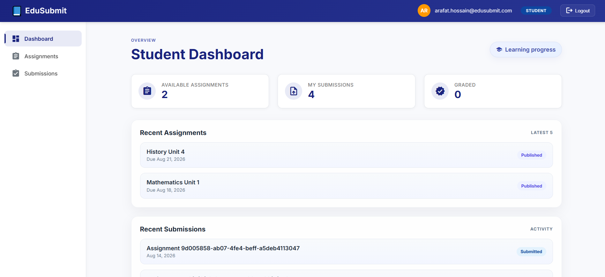
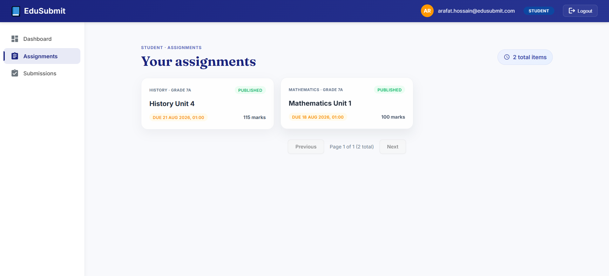
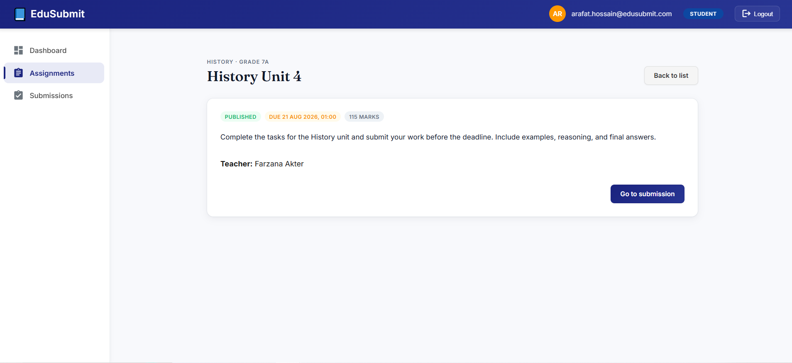
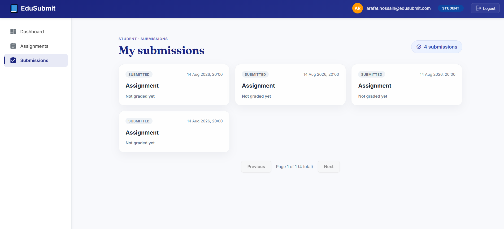
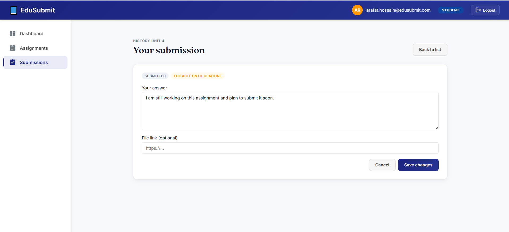

## Important Notes

- The API reads configuration from .NET user secrets during local development.
- The .env file is used for Docker environment values.
- Do not commit real secrets to source control.
- Since this is a free-hosted demo, the first cold start may take a little longer to respond.

## Final Note

EduSubmit is intended to demonstrate a realistic school management workflow with a clear backend architecture, role-based access control, and a polished Angular interface suitable for portfolio review and recruitment evaluation.
